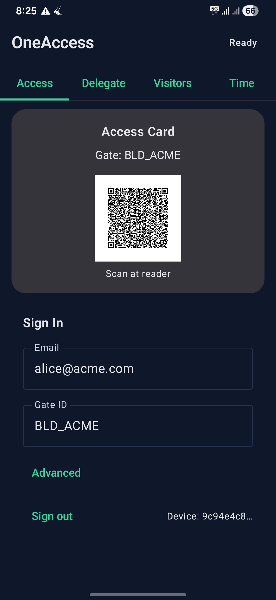
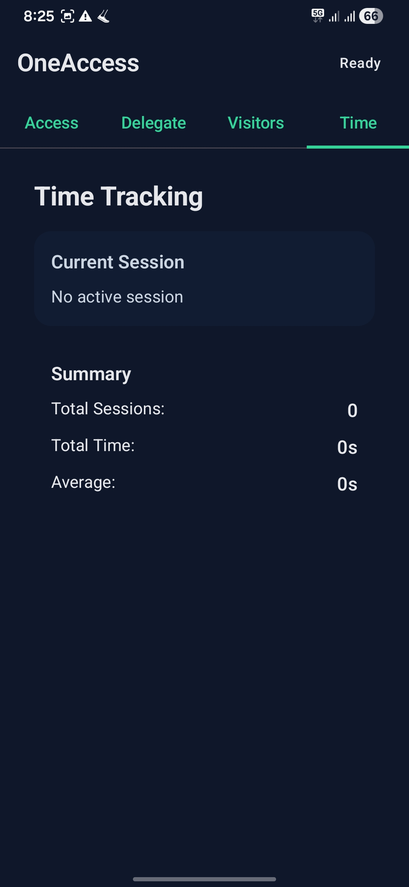
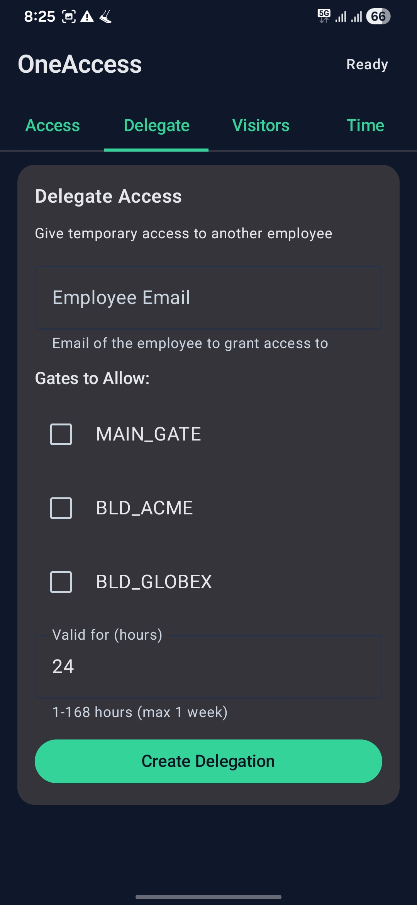
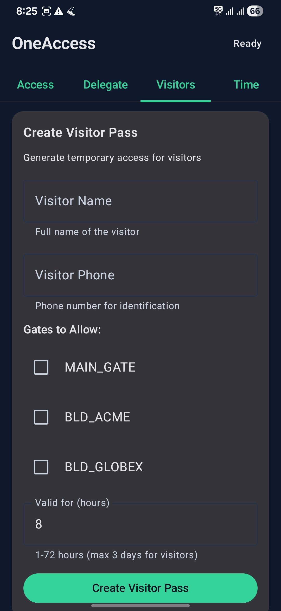
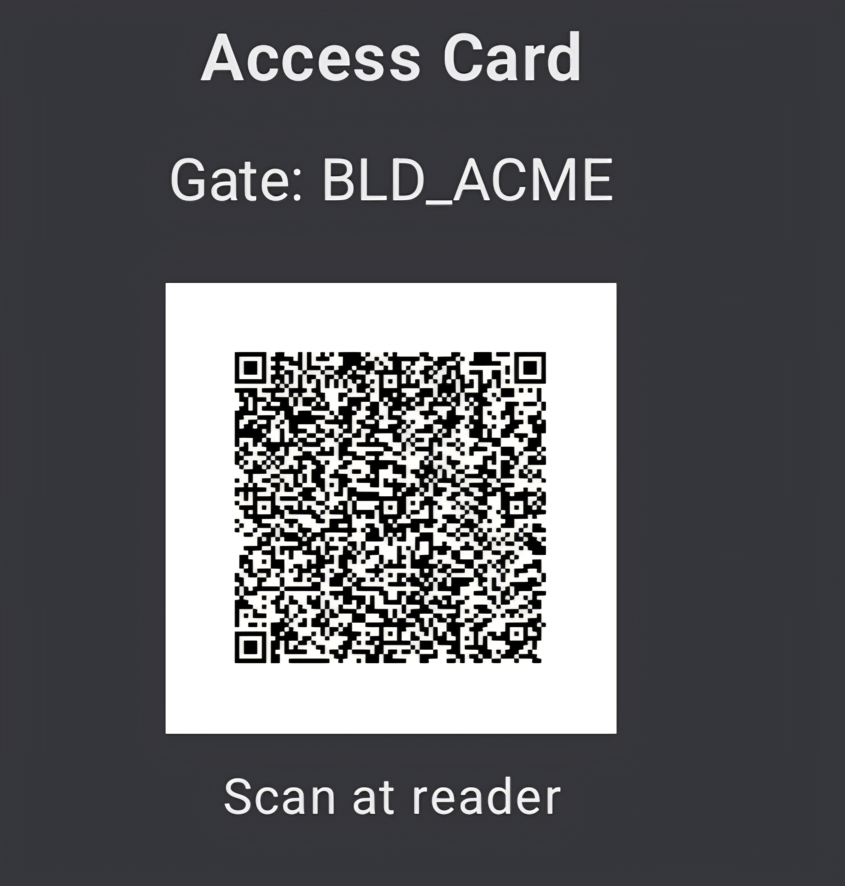
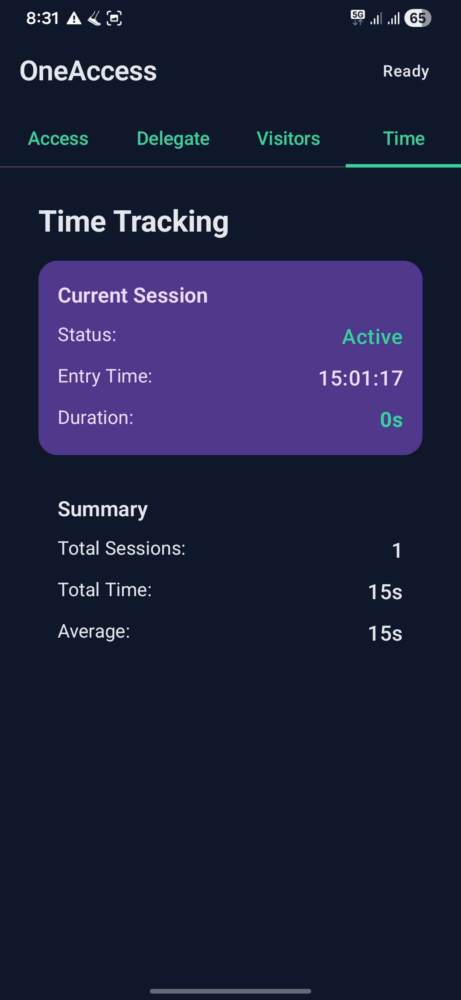

# 🚪 OneAccess

> **Your phone is your key.** Modern building access control powered by NFC card emulation, with intelligent time tracking and zero-touch entry.

<div align="center">

[](https://www.python.org/)
[](https://kotlinlang.org/)
[](https://flask.palletsprojects.com/)
[](https://developer.android.com/jetpack/compose)
[](LICENSE)

[Features](#-features) • [Quick Start](#-quick-start) • [Architecture](#-architecture) • [API](#-api-documentation) • [Demo](#-demo)

</div>

---

## 🎯 What is OneAccess?

**OneAccess** transforms your Android phone into a smart building access card using **NFC Host Card Emulation (HCE)**. No more juggling multiple access cards, fobs, or badges - just tap your phone and go.

But it's more than just a digital key:
- 📊 **Automatic time tracking** - Know exactly how long you spend in the office
- 🎫 **QR code generation** - Backup access method with auto-expiring codes
- 👥 **Guest management** - Create visitor passes with time limits
- 🔄 **Delegation** - Temporarily share access with colleagues
- ⚡ **Real-time sync** - Live session updates, no refresh needed

Perfect for modern offices, co-working spaces, residential buildings, or any facility that needs smart access control.

---

## ✨ Features

### 🔐 **Contactless Access**
- **NFC Card Emulation (HCE)** - Your phone becomes an access card
- **No Bluetooth Required** - Pure NFC, just like traditional cards
- **Works When Locked** - Tap to unlock, even with screen off

### ⏱️ **Intelligent Time Tracking**
- **Automatic Session Start** - Begins when you tap in
- **Live Duration Counter** - Real-time tracking updated every second
- **Session History** - View past entries with duration and timestamps
- **Daily Summaries** - Total time, average session length, and trends

### 🎫 **QR Code Access**
- **Generate Secure Codes** - Short-lived tokens for door readers
- **Auto-Refresh** - Codes expire and regenerate automatically
- **Fallback Method** - Works when NFC isn't available

### 👥 **Guest Management**
- **Visitor Passes** - Create time-limited access for guests
- **Custom Expiry** - Set exact validity periods
- **One-time Use** - Optional single-use passes

### 🔄 **Access Delegation**
- **Temporary Sharing** - Delegate your access to colleagues
- **Time-Bound** - Set start and end times
- **Revocable** - Cancel delegations anytime

### 🛡️ **Enterprise Security**
- **JWT Authentication** - Industry-standard token security
- **Short-Lived Tokens** - Access codes expire in seconds
- **Audit Logging** - Complete access history
- **Multi-Gate Support** - Different permissions per entrance

---

## 🏗️ Architecture

```
┌─────────────────┐         ┌──────────────────┐         ┌─────────────────┐
│                 │         │                  │         │                 │
│  Android App    │◄───────►│   Flask API      │◄───────►│  Access Reader  │
│  (Kotlin/      │  HTTPS   │   (Python 3.12)  │   NFC   │  (Physical      │
│   Compose)      │          │                  │         │   Hardware)     │
│                 │          │                  │         │                 │
└─────────────────┘         └──────────────────┘         └─────────────────┘
        │                            │
        │                            │
        ▼                            ▼
  ┌──────────┐              ┌──────────────┐
  │ AppState │              │  In-Memory   │
  │ (Prefs)  │              │  Data Store  │
  └──────────┘              └──────────────┘
```

### Tech Stack

**Mobile App:**
- **Language:** Kotlin
- **UI Framework:** Jetpack Compose (Material 3)
- **Networking:** OkHttp3
- **NFC:** Android HCE APIs
- **State Management:** Compose State + SharedPreferences

**Backend:**
- **Framework:** Flask (Python 3.12)
- **Authentication:** JWT (PyJWT)
- **Data Store:** In-memory (easily extensible to PostgreSQL/Redis)
- **Deployment:** Render.com (free tier)

**Security:**
- JWT tokens with configurable expiry
- HMAC-SHA256 signature verification
- Device ID tracking
- Request validation

---

## 🚀 Quick Start

### Prerequisites
- **Android Studio** (latest version)
- **Python 3.12+**
- **Git**
- An Android phone with NFC support

### 1. Clone the Repository

```bash
git clone https://github.com/yourusername/oneaccess.git
cd oneaccess
```

### 2. Backend Setup

```bash
# Navigate to backend
cd backend

# Install dependencies
python -m pip install -r requirements.txt

# Start the server
python -m flask run --host=0.0.0.0 --port=8000
```

Backend will be running at `http://localhost:8000`

### 3. Android App Setup

```bash
# Open Android Studio
# File → Open → Select the 'android' folder

# Or build from command line
cd android
./gradlew assembleDebug
```

APK will be at: `android/app/build/outputs/apk/debug/app-debug.apk`

### 4. Install & Configure

1. **Install APK** on your phone
2. **Open the app**
3. **Sign in:**
   - Email: `alice@acme.com` (demo user)
   - Gate ID: `BLD_ACME`
4. **Backend URL:** 
   - Emulator: `http://10.0.2.2:8000`
   - Real device: `http://YOUR_LAPTOP_IP:8000`
   - Production: `https://oneaccess-backend.onrender.com`

---

## 📱 Usage

### Access Methods

**Method 1: NFC Tap (Recommended)**
1. Approach the door reader
2. Tap your phone (screen can be off)
3. Door unlocks automatically

**Method 2: QR Code**
1. Open the app → Access tab
2. Show QR code to reader
3. Code auto-refreshes every 20 seconds

### Time Tracking

- **Entry:** Tap at building entrance → Session starts
- **Exit:** Tap at building exit → Session ends, duration recorded
- **View Stats:** Open Time tab → See live duration, total hours, averages

### Delegation

1. Open **Delegate** tab
2. Enter recipient email and gate ID
3. Set start and end times
4. Click **Create Delegation**
5. Recipient gets access for specified period

### Visitor Passes

1. Open **Visitors** tab
2. Enter visitor name and gate
3. Set expiry time and use count
4. Click **Create Pass**
5. Share generated code with visitor

---

## 📚 API Documentation

### Authentication

**Login**
```http
POST /auth/login
Content-Type: application/json

{
  "email": "alice@acme.com"
}

Response:
{
  "accessToken": "eyJ0eXAiOiJKV1QiLCJhbGc...",
  "userId": "USR_ALICE",
  "companyId": "ACME"
}
```

### Access Control

**Issue QR Token**
```http
POST /qr/token
Authorization: Bearer {accessToken}
Content-Type: application/json

{
  "gateId": "BLD_ACME",
  "readerNonce": "READER_123",
  "deviceId": "device-uuid"
}

Response:
{
  "token": "eyJ0eXAiOiJKV1QiLCJhbGc...",
  "expEpochSeconds": 1707890123
}
```

**Verify Access**
```http
POST /access/verify
Content-Type: application/json

{
  "readerId": "FRONT_DOOR",
  "gateId": "BLD_ACME",
  "token": "eyJ0eXAiOiJKV1Qi...",
  "doorOpened": true,
  "direction": "ENTRY"
}

Response:
{
  "decision": "ALLOW",
  "reason": "OK",
  "timeTracking": {
    "action": "SESSION_STARTED",
    "sessionId": "session-uuid"
  }
}
```

### Time Tracking

**Get Current Session**
```http
GET /time/current
Authorization: Bearer {accessToken}

Response:
{
  "sessionId": "session-uuid",
  "entryTime": "2026-02-01T09:30:00",
  "currentDurationSeconds": 3600,
  "currentDurationFormatted": "1h 00m 00s",
  "gateIdEntry": "BLD_ACME"
}
```

**Get Time Summary**
```http
GET /time/summary
Authorization: Bearer {accessToken}

Response:
{
  "totalSessions": 45,
  "totalTimeFormatted": "360h 30m 15s",
  "averageTimeFormatted": "8h 00m 40s",
  "todaySessions": 1,
  "todayTimeFormatted": "3h 45m 20s",
  "hasActiveSession": true
}
```

[Full API Documentation](./API.md)

---

## 🧪 Testing

### Test Time Tracking (PowerShell)
```powershell
cd backend
./scripts/demo_workday.ps1
```

This simulates:
- Employee entry at 9:00 AM
- 8-hour work session
- Exit at 5:00 PM
- Displays session summary

### Test on Phone
```powershell
./test_phone_app.ps1
```

Simulates entry/exit for your phone's signed-in user.

---

## 🎨 Screenshots

<div align="center">

| Access Tab | Time Tracking | Delegation |
|------------|---------------|------------|
|  |  |  |

| Visitor Pass | QR Code | Live Session |
|--------------|---------|--------------|
|  |  |  |

</div>

---

## 🗺️ Roadmap

- [ ] **Cloud Database** - PostgreSQL/Redis for persistent storage
- [ ] **Biometric Auth** - Fingerprint/Face ID before access
- [ ] **Multi-Building Support** - Manage access across multiple locations
- [ ] **Analytics Dashboard** - Web portal for admin insights
- [ ] **Push Notifications** - Entry/exit alerts, delegation requests
- [ ] **Offline Mode** - Cached tokens for no-connectivity scenarios
- [ ] **Bluetooth Fallback** - BLE option for non-NFC readers
- [ ] **iOS App** - Core Wallet Pass + companion app
- [ ] **Web Admin Panel** - Manage users, gates, and permissions
- [ ] **Integration APIs** - Slack, Teams, Google Calendar sync

---

## 🤝 Contributing

Contributions are welcome! Whether it's bug fixes, new features, or documentation improvements.

1. **Fork** the repository
2. **Create** a feature branch (`git checkout -b feature/AmazingFeature`)
3. **Commit** your changes (`git commit -m 'Add some AmazingFeature'`)
4. **Push** to the branch (`git push origin feature/AmazingFeature`)
5. **Open** a Pull Request

See [CONTRIBUTING.md](CONTRIBUTING.md) for detailed guidelines.

---

## 📄 License

This project is licensed under the **MIT License** - see the [LICENSE](LICENSE) file for details.

---

## 🙏 Acknowledgments

- **Flask** - Lightweight and powerful Python web framework
- **Jetpack Compose** - Modern Android UI toolkit
- **OkHttp** - Efficient HTTP client for Android
- **PyJWT** - JWT implementation for Python
- **Material Design 3** - Beautiful and accessible UI components

---

## 💬 Support

**Found a bug?** [Open an issue](https://github.com/yourusername/oneaccess/issues)

**Have a question?** [Start a discussion](https://github.com/yourusername/oneaccess/discussions)

**Want to chat?** Reach out at your.email@example.com

---

<div align="center">

**Built with ❤️ for modern access control**

[⬆ Back to Top](#-oneaccess)

</div>
